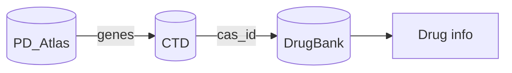
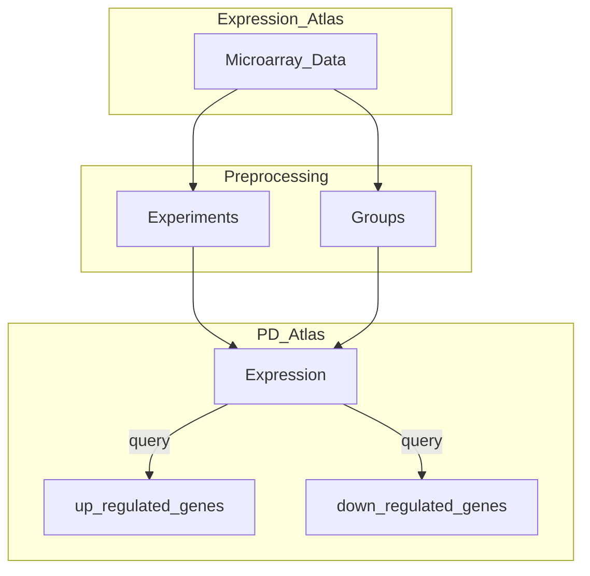
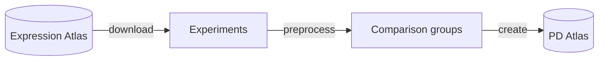
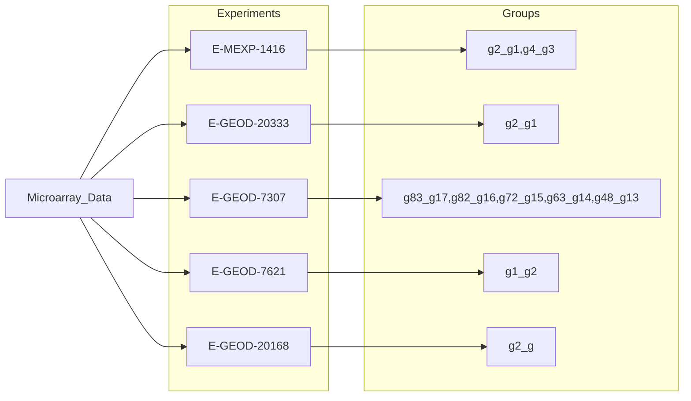
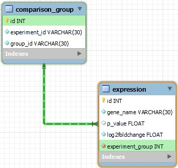
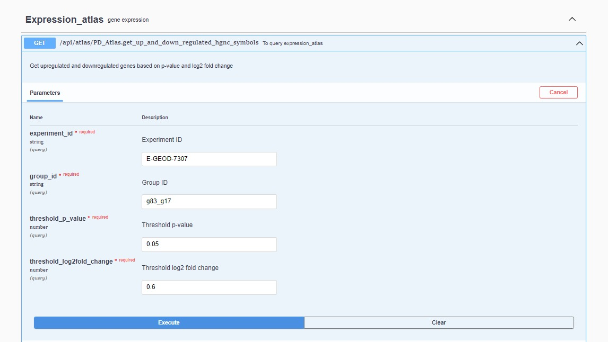
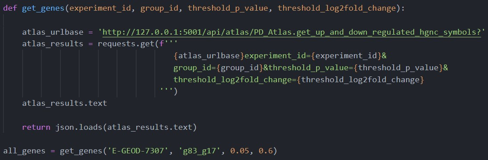

# Report on Biodb-Expression-Atlas

Submitted by - Kriti Amin, Zexin Li, Shubhi Ambast (Group-1)

# Introduction
---
## State of the art

**ParkDB: a Parkinson’s disease gene expression database**

ParkDB, a resource that aims to provide comprehensive access to high quality gene expression datasets analyzed in a homogeneous manner.

- Database contains a complete set of re-analyzed, curated and annotated microarray datasets.
- This resource enables scientists to identify and compare expression signatures involved in PD.
- Microarray data collected from:

  - ArrayExpress
  - Gene Expression Omnibus (GEO)
  - Stanford microarray database
- Usage : to perform data analysis and discovery of relationships between genes involved in PD in several human brain regions, as well as across multiple model organisms or cell lines.

## Parkinson's Disease
Parkinson's disease is a neurodegenerative disorder that affects approximately 10 million people worldwide. Most patients that are diagnosed with Parkinson's disease are older than 50 years (~96 %). 
There is no cure of the disease but there are several drugs used to treat the symptoms of Parkinson's disease like:
- Levodopa
- Pramipexole
- Safinamide


## ParkinsonDrugPredictor(PDP)

PDP is a tool to predict potential drugs for Parkinson's disease from gene expression experiment data.

Databases used in the project are :
##### 1. [Expression Atlas](https://www.ebi.ac.uk/gxa/home)
   Database about gene and protein expression 

##### 2. The Comparative Toxicogenomics Database([CTD](http://ctdbase.org/))
Database about chemical–gene/protein interactions, chemical–disease and gene–disease relationships

##### 3. [DrugBank](https://go.drugbank.com/)
Database containing information on drugs and drug targets

### Algorithm of PDP

- Extract up and down regulated genes from the gene expression data. (Expression Atlas)
- Get chemical data associated with the genes involved in the expression studies. (CTD)
    - find chemicals that reverse the up/down regulation caused by the disease
- Identify potential drugs based on the chemical data. (DrugBank)
    - phases of drug development (approved drug, drug repurposing, not approved compound)



## Expression Atlas


**Expression Atlas** is an open science resource that gives users a powerful way to find information about gene and protein expression.
provides gene expression results on more than 3,000 experiments from 40 different organisms, including metazoans and plants.

- Browse experiments tab, which shows the users a table listing all the experiments currently available in Expression Atlas.

- Users can find two kinds of expression results:
  - baseline expression
  - differential expression

- Criteria to assess expression : log2 fold-change and the adjusted p-value


#### Aim of our package

Our group majorly focuses on handling gene expression data. Our task was to look for those gene expression experiments which concerns Parkinson's disease.




# Material and Methods
---

The main goal of the package is to return a list of upregulated and downregulated HGNC gene symbols using the microarray data from Expression Atlas related to Parkinson's Disease. The package is built in _python_ environment (specifically python==3.9) using several python libraries. _MySQL_ is used as the relational database management system. Major tasks done by the algorithm used in the backend code of the package are as follows:



> 1. Download data

Expression Atlas database has large number of experiments of microarray studies which contain microarray data. This data is downloaded from the [ftp server](http://ftp.ebi.ac.uk/pub/databases/microarray/data/atlas/experiments/) in tsv format. Only five experiments which are relate to Parkinson's Disease are downloaded (Diagram 1).
When the user installs the package, the algorithm checks if the system contains the required files using ``Path`` and ``os`` modules; Otherwise the required tsv files are downloaded from the ftp server by making an API request using the ``requests`` library. The downloaded files are stored in ``{home_directory}/.Biodb_expression_atlas/data`` for preprocessing and importing data into the database.

> 2. Data Preprocessing

Preprocessing is required because the microarray data contains different comparison groups. Combinations of experiment and comparison groups concerned with Parkinson's Disease are selected to be imported into the database. Diagram 1 shows the experiments and the groups that are filtered out. The ``pandas`` module is used in this step. The pseudo code for preprocessing of data is as follows:

```
Table = pandas.DataFrame
for one_experiment_file in data_files:
    Read one_experiment_file
    Find relevant comparison_groups in one_experiment_file
    Concatenate subset_data to Table
```



_Diagram 1 :_ Selected comparison groups that are relevant to Parkinson's Disease nad corresponding experiment ids.


> 3. Create Database

MySQL database named **pd_atlas** is created in the user's system when the user runs the ``import_database`` command on the command line interface. MySQL software is required to be already installed on the system. ``SQLALchemy`` and ``pymysql`` libraries are used to create and import data into the database.

> 4. Database Model

PD_Atlas database contains two tables **_expression_** and **_comparison_group_**. The table _expression_ conatins the preprocessed data which included the gene names, p-value, log2 fold change and the corresponding experiment group. The table _comparison_group_ contains information of the experiments and the corresponding comaprison groups. The relation between the two table is shown in the Figure 1 below: 


_Figure 1 :_ SQLALchemy model of PD_Atlas database.


> 5. GUI and API

The package provides a Graphical user interface (GUI) for user to run the program interactively. In addition, an Application Programming Interface (API) service is also developed to access and " _GET_ " information through http requests. **_Flask_** and **_Swagger_** frameworks are used to develop the web application and Restful API.


# Result
---

We developed a user-friendly Application Programming Interface (API) service that conforms to OpenAPI specification. Users are able to query our database using a graphical user interface. This requires the installation of our package and command-line function calling.


Firstly, they need to initialize the Parkinson's disease-based gene expression database by calling `import-database` method at the command-line interface (CLI). After importing the database, calling `serve` methods yields the query server interface. We deployed a get request method `get_up_and_down_regulated_hgnc_symbols` at which users are asked to provide four mandatory parameters as input: `experiment_id`, `group_id`, `threshold_p_value` and `threshold_log2fold_change` separately. The expected input parameters have been indicated with grey marks within the input boxes. When they execute a valid query, API service will return a successful server response with response code 200. The response body returns a dictionary of lists that contains a list of up-regulated genes and a list of down-regulated genes. The validity of query behavior mainly depends on whether the experiment id and group id are relevant to Parkinson's disease in the Expression Atlas database. 


As depicted in **Figure 2a**, for example, we queried with the following input parameters:

- Experiment ID: E-GEOD-7307

- Group ID: g83_g17

- Threshold p-value: 0.05

- Threshold log2 fold change: 0.6

  

The query result is returned in the form of JSON text of 23772 in length (**Figure 2b**). The order of up- or down- regulated genes are determined by the rank of their significance. The bigger (smaller) their positive (negative) log2 fold change value, the higher the order of HGNC symbols. In other words, the top several genes are usually of most interest. Based on above example, we get upregulated and downregulated genes based on p-value = 0.05 and log2 fold change = 0.6. These gene lists will be the input for CTD query later.




**Figure 2a.** API query interface.


**Figure 2b.** API response interface.


The developers who interests in our package are allowed to make use of it in a GUI-free way. Users can request for regulated genes as they utilize other Restful API, as long as the request URL is specified correctly. The root of endpoint is dependent of host and port, followed by standard path that is predefined in the `openapi.yaml` file. At last, users need to specify the query parameters. An exemplary request can be seen in **Figure 3**, which uses the same input parameters as the previous use case in graphical API server. In this way, the developer are allowed to re-use and analyze the query results with Python conveniently, especially when they want to combine the API request with other downstream coding tasks.



**Figure 3.** Code for python query.

## Discussion


### Challenges

The primary challenge of the development of this algorithm is the extraction of gene expression experiment as well as how to organize the database structure. Not all the gene expression data in the Expression Atlas are related to Parkinson's disease, of which not every variables are meaningful to our hypothesis. Unfortunately, the gene expression dataset downloaded from Expression Atlas does not include any explanation of variables. We have to examine the [ftp server](http://ftp.ebi.ac.uk/pub/databases/microarray/data/atlas/experiments/) to find the basic configuration file of Microarray experiment. On the other hand, due to the lack of a unique id for each group of an experiment while taking multiple experiments into account, we have to create a new primary key for a unique mapping with regards to the combination of experiment and group. 


### Improvement

The probable improvement considers the generalization of the algorithm. Currently, the acceptable disease scope of the algorithm is restricted to Parkinson's disease. It would be more helpful if users are allowed to specify the disease of interest. However, it may pose some potential challenges in the context of including multiple diseases, for example, how to deal with conflicting terms for the same disease.


Another thought of further improvement of interest is the explosion of other useful information. We hide the complexity based on reduction of redundant information, however, we sacrifice other information simultaneously. Although the current interface is concise enough to maintain the usability, some users may interest in extra information such as the actual value of log2 fold change of each genes. We may create another get method so that users can acquire these information.

