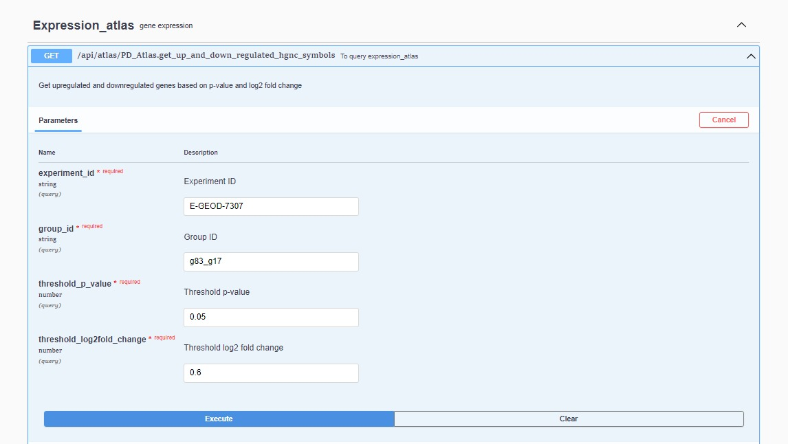
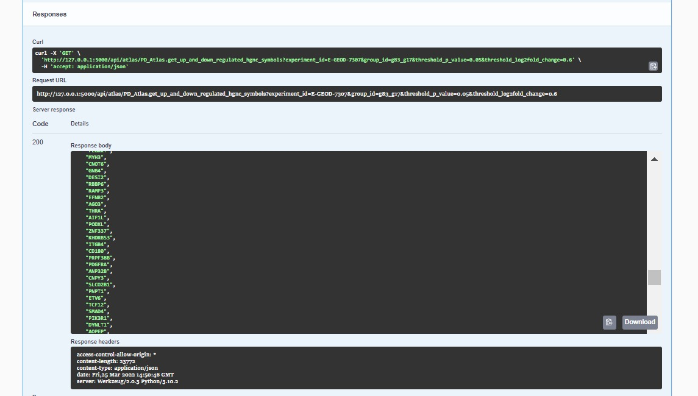
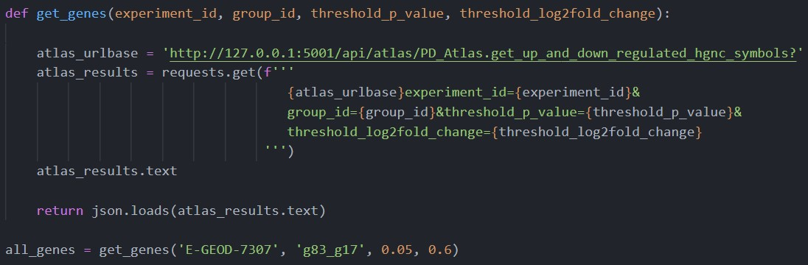

# Report

## Result

We developed a user-friendly Application Programming Interface (API) service that conforms to OpenAPI specification. Users are able to query our database using a graphical user interface. This requires the installation of our package and command-line function calling.

Firstly, they need to initialize the Parkinson's disease-based gene expression database by calling `import-database` method at the command-line interface (CLI). After importing the database, calling `serve` methods yields the query server interface. We deployed a get request method `get_up_and_down_regulated_hgnc_symbols` at which users are asked to provide four mandatory parameters as input: `experiment_id`, `group_id`, `threshold_p_value` and `threshold_log2fold_change` separately. The expected input parameters have been indicated with grey marks within the input boxes. When they execute a valid query, API service will return a successful server response with response code 200. The response body returns a dictionary of lists that contains a list of up-regulated genes and a list of down-regulated genes. The validity of query behavior mainly depends on whether the experiment id and group id are relevant to Parkinson's disease in the Expression Atlas database. 

As depicted in **Figure 1a**, for example, we queried with the following input parameters:

- Experiment ID: E-GEOD-7307

- Group ID: g83_g17

- Threshold p-value: 0.05

- Threshold log2 fold change: 0.6

  

The query result is returned in the form of JSON text of 23772 in length (**Figure 1b**). The order of up- or down- regulated genes are determined by the rank of their significance. The bigger (smaller) their positive (negative) log2 fold change value, the higher the order of HGNC symbols. In other words, the top several genes are usually of most interest. Based on above example, we get upregulated and downregulated genes based on p-value = 0.05 and log2 fold change = 0.6. These gene lists will be the input for CTD query later.

**Figure 1a.** API query interface.

**Figure 1b.** API response interface.

The developers who interests in our package are allowed to make use of it in a GUI-free way. Users can request for regulated genes as they utilize other Restful API, as long as the request URL is specified correctly. The root of endpoint is dependent of host and port, followed by standard path that is predefined in the `openapi.yaml` file. At last, users need to specify the query parameters. An exemplary request can be seen in **Figure 2**, which uses the same input parameters as the previous use case in graphical API server. In this way, the developer are allowed to re-use and analyze the query results with Python conveniently, especially when they want to combine the API request with other downstream coding tasks.

## Discussion

### Challenges

The primary challenge of the development of this algorithm is the extraction of gene expression experiment as well as how to organize the database structure. Not all the gene expression data in the Expression Atlas are related to Parkinson's disease, of which not every variables are meaningful to our hypothesis. Unfortunately, the gene expression dataset downloaded from Expression Atlas does not include any explanation of variables. We have to examine the [ftp server](http://ftp.ebi.ac.uk/pub/databases/microarray/data/atlas/experiments/) to find the basic configuration file of Microarray experiment. On the other hand, due to the lack of a unique id for each group of an experiment while taking multiple experiments into account, we have to create a new primary key for a unique mapping with regards to the combination of experiment and group. 

### Improvement

The probable improvement considers the generalization of the algorithm. Currently, the acceptable disease scope of the algorithm is restricted to Parkinson's disease. It would be more helpful if users are allowed to specify the disease of interest. However, it may pose some potential challenges in the context of including multiple diseases, for example, how to deal with conflicting terms for the same disease.

Another thought of further improvement of interest is the explosion of other useful information. We hide the complexity based on reduction of redundant information, however, we sacrifice other information simultaneously. Although the current interface is concise enough to maintain the usability, some users may interest in extra information such as the actual value of log2 fold change of each genes. We may create another get method so that users can acquire these information.

